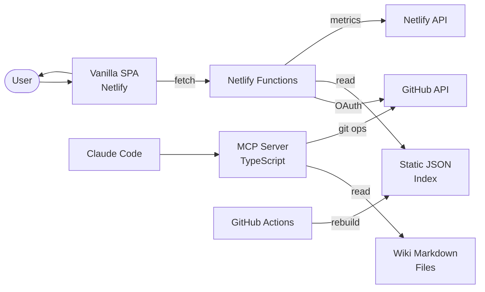

# Code Wiki Data Flow

Personal knowledge base with dual interfaces: web SPA and MCP server for AI agents.

## Key Services
- **MCP Server**: Exposes wiki search, document retrieval, and health tools to Claude Code
- **Netlify Functions**: API proxy for OAuth, index serving, and metrics
- **GitHub Actions**: Daily index rebuild from wiki markdown + repo metadata
- **Observatory**: Dashboard pulling deploy status from Netlify and GitHub APIs
