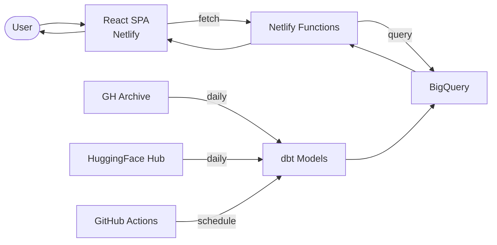

# Datastic Data Flow

Data analytics dashboard pulling from GH Archive and HuggingFace Hub via BigQuery.

## Key Services
- **GitHub Actions**: Scheduled dbt runs to transform raw data
- **dbt**: Data modeling layer on top of BigQuery
- **BigQuery**: Warehouse for GH Archive and HuggingFace data
- **Netlify Functions**: Query proxy to BigQuery (server-side credentials)
