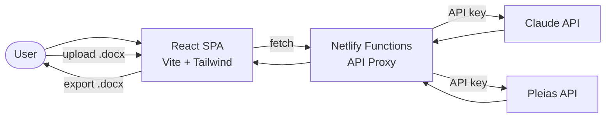

# EthicalAIditor Data Flow

AI-powered document editing and ethical analysis tool with .docx import/export.

## Key Services
- **Netlify Functions**: API proxy for Claude and Pleias
- **Claude API**: AI-powered editing suggestions and analysis
- **Pleias API**: Ethical analysis and bias detection
- **Document processing**: .docx import/export via client-side parsing
