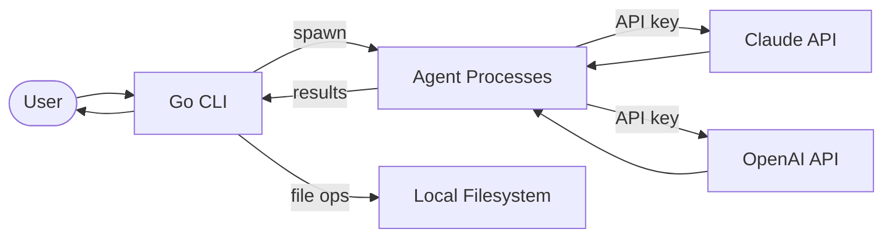

# Gastown Data Flow

Multi-agent orchestration CLI written in Go.

## Key Services
- **Go CLI**: Orchestrates multiple AI agent processes
- **Claude + OpenAI APIs**: Multi-provider LLM backends for agents
- **Local filesystem**: Agent work products and file operations
