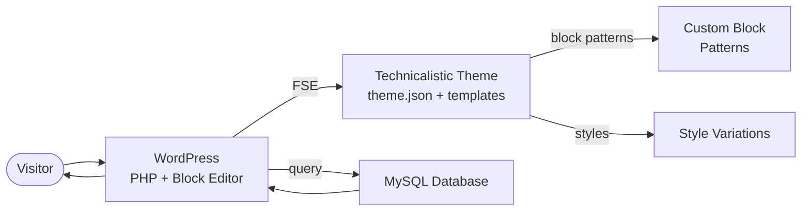

# Technicalistic WP Theme Data Flow

WordPress Full Site Editing block theme submitted to wordpress.org directory.

## Key Services
- **WordPress FSE**: Full Site Editing with theme.json configuration
- **Block patterns**: Custom reusable block patterns
- **Style variations**: Multiple visual styles selectable by the user
- **MySQL**: Standard WordPress database for content
