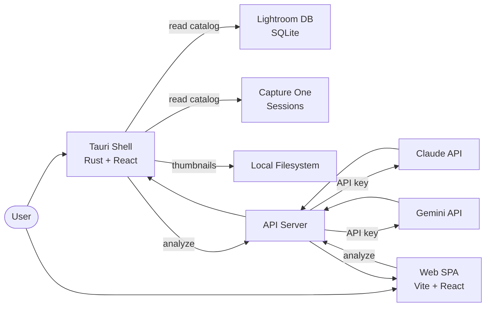

# LensQuery Data Flow

Cross-platform photo library query tool — Tauri desktop app + web SPA.

## Key Services
- **Tauri shell (Rust)**: Native desktop app with filesystem access for catalogs and thumbnails
- **Web SPA**: Browser-based interface for remote access
- **API Server**: Backend for AI-powered image analysis
- **Claude + Gemini**: Multi-provider image analysis
- **Lightroom + Capture One**: Read catalog databases (SQLite for LR, session files for C1)
