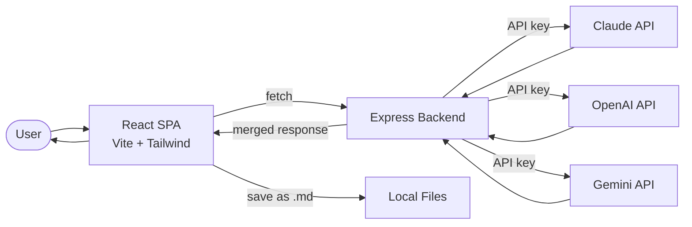

# Metabot Data Flow

Multi-AI aggregation app that queries multiple LLM providers and merges responses.

## Key Services
- **Express backend**: Aggregates responses from multiple LLM providers
- **React SPA + Expo mobile**: Dual frontend (web and mobile)
- **Local file storage**: Conversations saved as .md files
