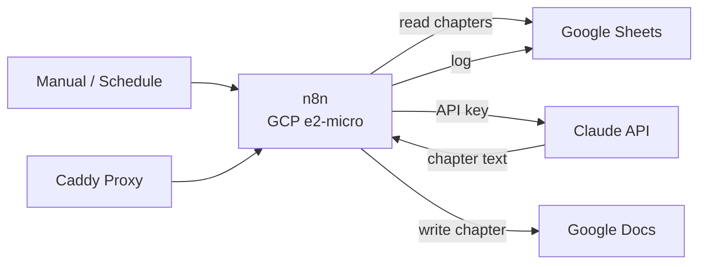

# n8n Workflows Data Flow

Novel orchestration pipeline — self-hosted n8n on GCP e2-micro instance.

## Key Services
- **n8n**: Self-hosted on GCP e2-micro (1GB RAM), Docker Compose
- **Caddy**: Reverse proxy with automatic HTTPS
- **Claude API**: Chapter generation and editing
- **Google Sheets**: Chapter metadata, project logs, orchestration state
- **Google Docs**: Final chapter output
