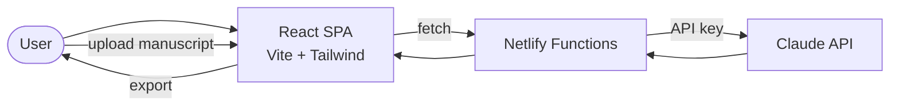

# Novelizer Data Flow

Novel writing assistant with AI-powered editing and manuscript import/export.

## Key Services
- **Netlify Functions**: API proxy for Claude
- **Claude API**: Writing assistance, editing suggestions, manuscript analysis
- **Document handling**: Manuscript import/export
