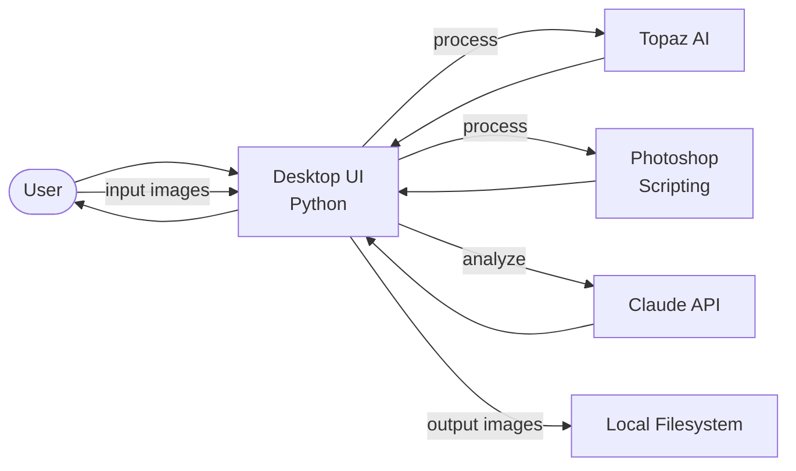

# PhotoPhreaker Data Flow

AI image decomposition with Topaz AI and Adobe Photoshop integration.

## Key Services
- **Python desktop UI**: Local application for image processing pipeline
- **Topaz AI**: AI-powered image enhancement and upscaling
- **Photoshop scripting**: Automated layer manipulation and compositing
- **Claude API**: Image analysis and decomposition guidance
- **Local filesystem**: Input/output image storage
