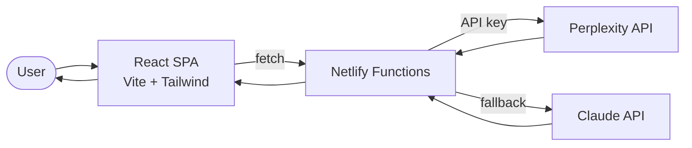

# SearchBard Data Flow

AI-powered search with multi-provider fallback.

## Key Services
- **Netlify Functions**: API proxy with provider fallback logic
- **Perplexity API**: Primary search provider (web-grounded)
- **Claude API**: Fallback when Perplexity is unavailable
