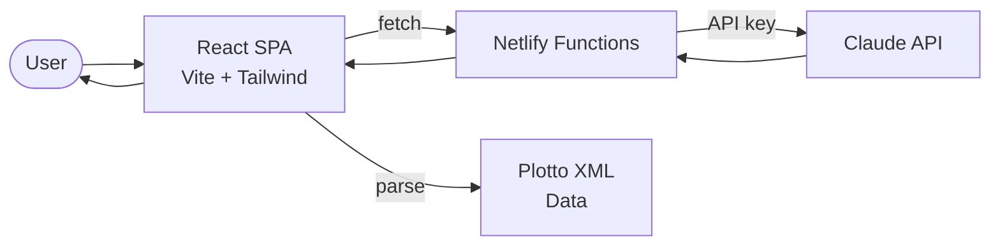

# StoryPlot Data Flow

Interactive story plot generator based on the Plotto system.

## Key Services
- **Netlify Functions**: API proxy for Claude
- **Claude API**: Story generation and plot expansion
- **Plotto XML**: Classic plot formula database parsed client-side
