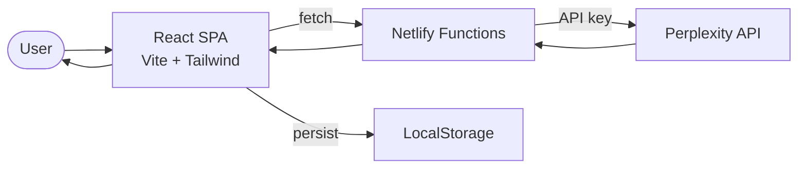

# Theorazine Data Flow

Calculator and theory exploration tool with Perplexity AI integration.

## Key Services
- **Netlify Functions**: API proxy for Perplexity
- **Perplexity API**: Theory exploration and research queries
- **LocalStorage**: Calculator state and history persistence
