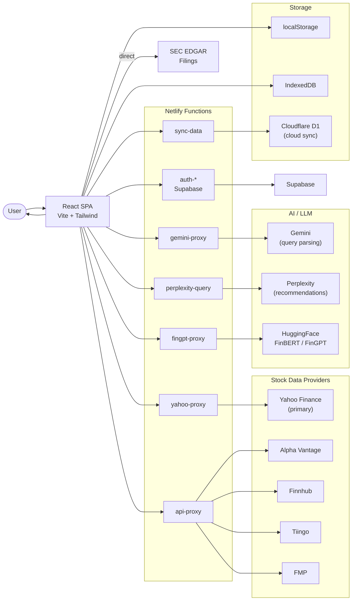

# ValueApe Data Flow

Stock analysis dashboard with multi-provider data, AI recommendations, FinGPT sentiment analysis, and Cloudflare D1 cloud sync.

## Key Services
- **Netlify Functions**: Server-side proxies protecting all API keys (api-proxy, yahoo-proxy, gemini-proxy, perplexity-query, fingpt-proxy)
- **Stock data providers**: Yahoo Finance (primary, crumb/cookie auth), Alpha Vantage, Finnhub, Tiingo, FMP (all with fallback chain)
- **AI/LLM**: Gemini for natural language query parsing, Perplexity for AI stock recommendations, HuggingFace FinBERT/FinGPT for sentiment analysis
- **SEC EDGAR**: Direct client-side access (no API key required, 10 req/sec rate limit)
- **Storage**: localStorage + IndexedDB client-side, Cloudflare D1 for cloud sync, Supabase for auth

## Query Modes
- **Quick mode**: Single primary data provider, fastest response
- **Synthesis mode**: Fetches from all available providers, averages numeric fields
- **Difference mode**: Fetches from all providers, highlights >10% deviations
